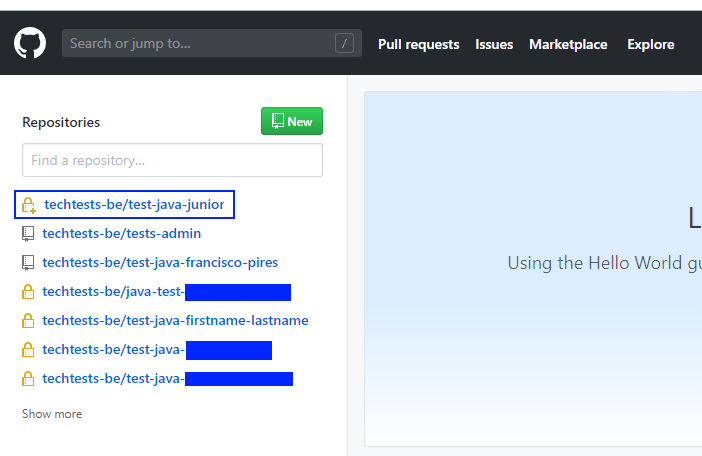
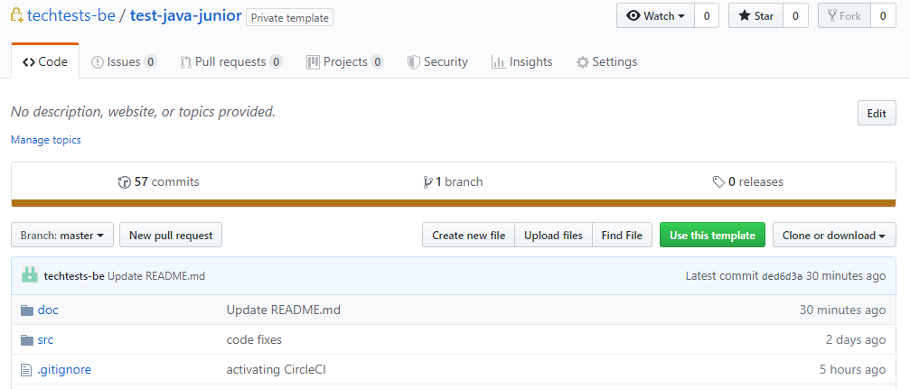
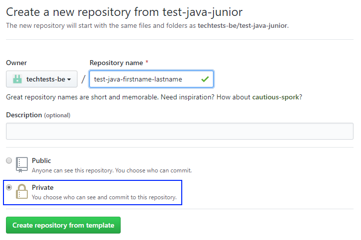
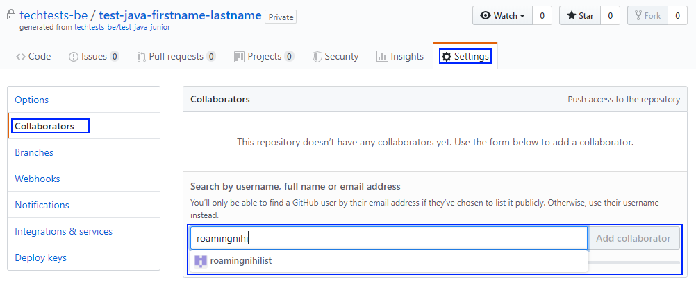

# Tests - Administration

This repository contains the procedure guide (this file) and will contain in the future any administrative files required by the procedure.

## Overview

GitHub (this site) is a cloud solution for version control system (VCS) based on Git. A VCS is a tool that can be seen as a database for code - i.e. a place to store code and the history of changes. In git, that "database" is called a repository.

This GitHub account contains the following base repositories:
 - tests-admin: this repository. It contains information and other administrative tools and files that are part of the technical test procedure.
 - test-java-junior: a template repository containing the test for Java Junior.

As tests on different technologies and seniority levels are created, new template repositories will also be added to this account.

The credentials of this account are shared by an appropriate private medium.

To create a new test for a candidate, it is required to create a new repository from a template repository. The full procedure is described in the remainder of this document.

## General Procedure

The table below illustrates the BM, candidate, and TD activities within the procedure.

| BM | Candidate | TD |
|----|-----------|----|
| 1. BM asks the candidate to send his/her GitHub username | | |
| | 2. Candidate creates the account (if neeeded) and sends the username to the BM | |
| 3. BM prepares a repository for the candidate and adds candidate as collaborator in GitHub | | |
| | 4. Candidate accesses repository and executes the test as described in the guide | |
| | 5. Candidate notifies BM once the exercise is finished and code pushed to the repository | |
| 6. BM notifies TD that test is ready for evaluation | | |
| | | 7. TD evaluates test and reports evaluation to BM |
| 8. BM integrates technical evaluation on the final decision | | |

The steps are described in the remainder of the section.

### 1. [BM] Asking candidate to send his/her GitHub username

This step can be executed by any preferred communication channel. The important message to be transmitted is that:
 - The exercise is all based on a GitHub repository, and for that reason we need to add the candidate as contributor
 - We need the username associated to an email that the candidate has access to, as the invite will be sent to this associated email.
 
### 2. [Candidate] Provide a GitHub username to the BM

The candidate will reply to the BM request with his/her GitHub username. Once the BM has this information, the candidate repository can be prepared.

### 3. [BM] Preparing a repository for the candidate in GitHub

1. Login to [GitHub](https://www.github.com) using the provided credentials, if you have not done it already

2. From the main page, press the **Repositories** tab, and then select the template repository you wish (in the image below, *test-java-junior*). This will bring you to the template repository.

3. Create a new repository from the **Use this template** button.

4. In the new screen, type the name of the candidate repository and set the repository to private. For the name, please use the naming convention: **test-*language*-*first_name*-*last_name***

5. In the **newly created repository** (candidate repository), you will have to add the candidate GitHub username as collaborator. To do so, navigate to the **Settings** tab, click on the **Collaborators** section, and use the text box to find the candidate login.

Once this last step is done, an invitation will be sent directly to the candidate. __Please explain to the candidate that the invitation comes directly from GitHub__.

### 4. [Candidate] Accessing the repository and executing the exercise

The repository has been tested with other candidates but there might be the odd event that needs support. The candidate should be free to come back with issues found, which will be redirected to the technical department (by the BM) for resolution.

### 5. [Candidate] Notifying the completion of the exercise

Once the exercise is completed and pushed, the consultant has to notify the BM through any of the mediums made available for this purpose.

### 6. [BM] Requesting evaluation by TD

At this stage - and for the time being - the BM notifies the TD that a test is ready for evaluation.

### 7. [TD] Evaluating the technical test

The TD will access the candidate repository to ensure the completion of exercises and evaluate the quality of the code. The conclusions will be shared with the BM.

### 8. [BM] Integrating conclusions with the decision

The TD is available for further discussions around the technical capacity of the candidate, but it is up to the BM to make the final decision.